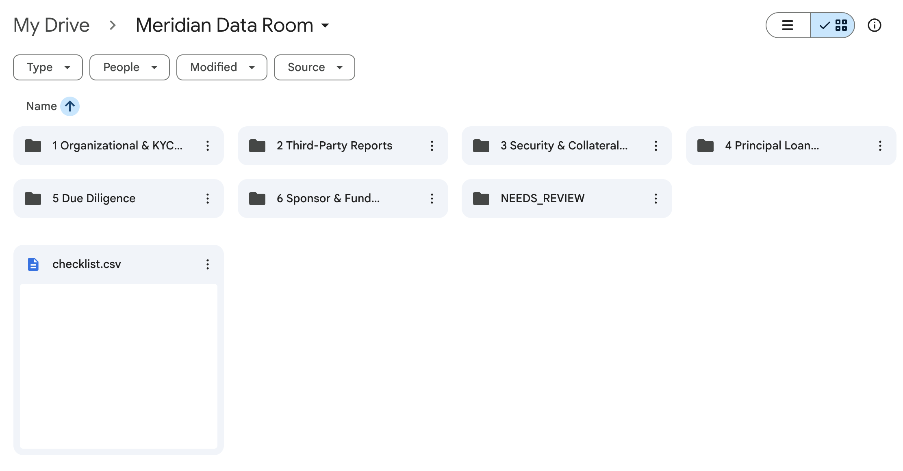
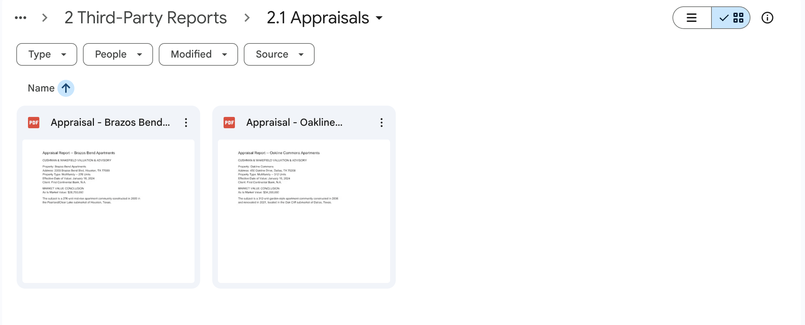
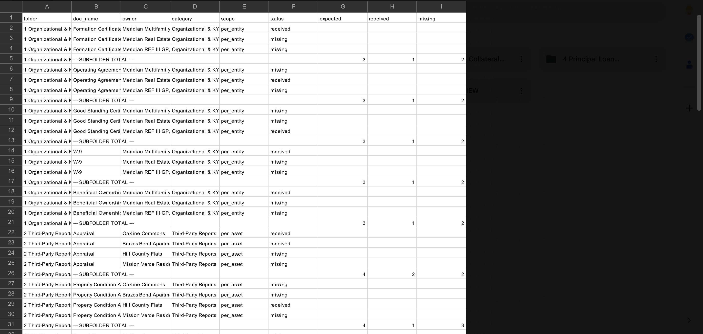
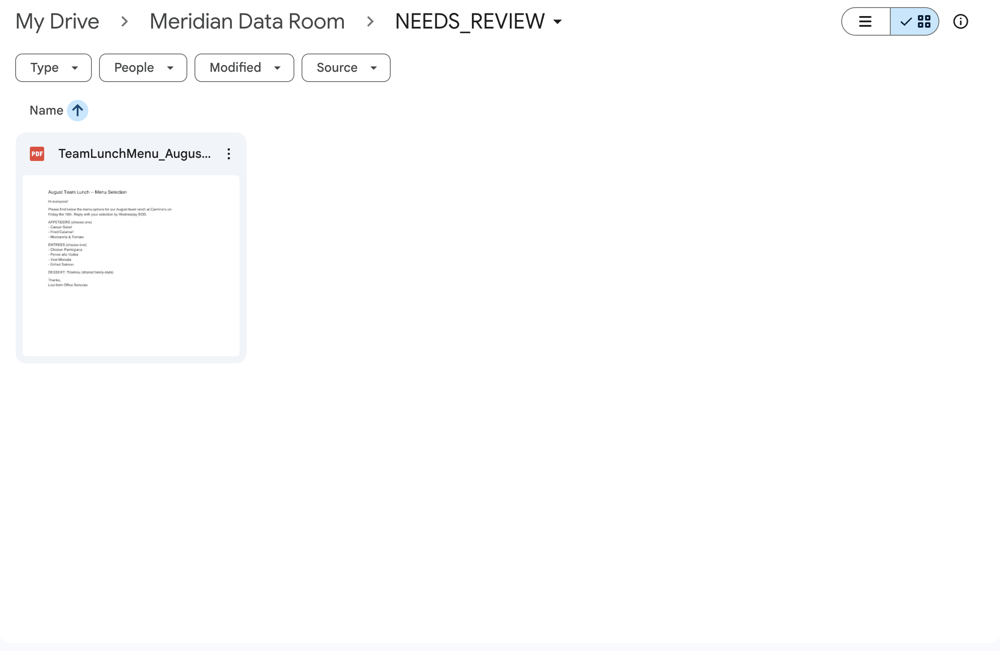

# DealRoom

## The problem

Closing data rooms are assembled by hand. An associate creates 40+ folders, renames hundreds of files, and manually tracks what's arrived and what's missing across dozens of counterparties. When documents come in as `scan_0042.pdf` or `attachment_final_v2.pdf`, someone has to open each one, figure out what it is, and put it in the right place. The result: hours of filing, stale checklists, and chaser emails that go out late because nobody had a clean view of what was outstanding.

## What this does

DealRoom reads a term sheet and builds a complete, self-auditing closing data room — no manual setup.

1. **Term sheet PDF in** — the LLM extracts a structured deal profile: deal type, borrower, guarantors, assets, lender, facility features
2. **Rules engine fires** — selects the matching deal-type taxonomy and computes every expected document (72 for this deal, derived from the profile, not hardcoded)
3. **Folder tree built** — numbered categories and doc-type subfolders created directly in Google Drive (or any local path) with a `checklist.csv` tracking every expected item
4. **Documents dropped in** — a messy zip of files gets extracted; every file is read, classified against the manifest by content, filed into the correct folder, and renamed to a standard convention
5. **Checklist updates live** — received/missing counts recompute automatically as documents are filed
6. **Missing-doc report generated** — outstanding items grouped by responsible party (borrower's counsel, third-party vendors, internal drafting) with a draft chaser email per party, ready to send


*The full data room tree built directly into Google Drive from a single term sheet.*

## Demo results

Starting from 22 test files (a realistic mix of clean and messy uploads):

| Outcome | Count | Details |
|---------|-------|---------|
| Filed correctly | 20 | Matched to the right folder and renamed |
| Classified by content | 5 of 20 | Files like `scan_0042.pdf`, `doc(3).pdf`, `IMG_20240815.pdf` — meaningless filenames, identified from the document text |
| Draft routed | 1 | Lender's redline of the Loan Agreement sent to `4.1 Drafts/` without ticking the executed checklist |
| Flagged for review | 1 | A lunch menu (decoy) caught and moved to `NEEDS_REVIEW/` |


*Two appraisals filed and renamed: the originals were `Appraisal_Oakline_Commons.pdf` and `Appraisal_Brazos_Bend.pdf`.*


*The checklist after sorting — 20 received, 52 missing, per-subfolder totals computed automatically.*


*Files the system can't confidently identify are flagged for human review, never silently misfiled.*

## Why this matters

Lawyers should audit what models produce, not do the busywork models are good at. Filing, renaming, and tracking documents against a checklist is mechanical — the value is in knowing what's missing and chasing it down. DealRoom handles the organization so the closing team can focus on the substance: reviewing documents, catching issues, and getting to signing.

## Roadmap

- **Term-sheet variety testing** — unsecured term loans, revolvers, construction loans, subscription lines
- **Drafting from precedent** — generate first-draft loan documents from extracted deal terms + a precedent library
- **VDR export packages** — numbered zip + index sheet formatted for Intralinks/Datasite upload
- **Email intake** — documents arriving by email filed automatically
- **Hosted/secured productization** — auth, encryption at rest, audit logging, SOC 2

## Run the demo

```bash
./demo.sh
```

Resets the data room, regenerates 22 test documents, zips them, sorts the zip, and prints the missing-document report. Requires Python 3.9+ and `pypdf` (`pip install pypdf`).

## Built with

Built in roughly a day with [Claude Code](https://claude.ai/claude-code). All deal data is fictional — no real term sheets, no real client documents.
